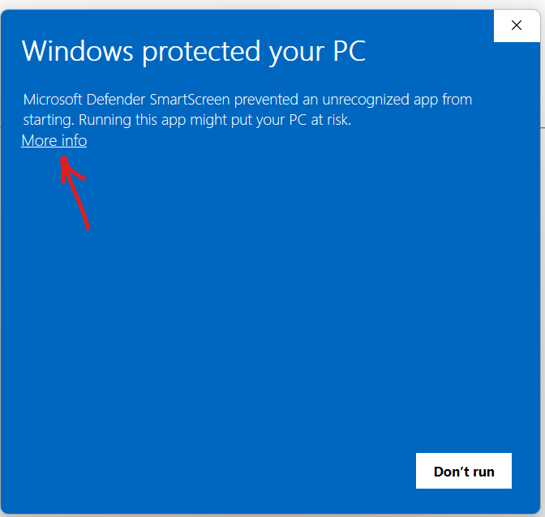
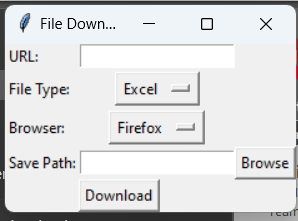

# CTCAC Downloader
This Executable Program allows users to batch download released CTCAC or CDLAC Applications. 
The Source Code is available in the Jupyter Notebook file. The Executable is available for download **[here](https://github.com/cengelh1/CTCAC_Downloader/blob/main/TCACDownloader.exe)**

# Download Instructions 
You may need to bypass your windows security settings for intstall. 

When you try to run it, you’ll need to bypass this window by clicking ‘Run Anyway’ after clicking 'more info’

 

 # Running the Program

Then you’ll see two windows launch. The small one will take a second to load, but that is where you can enter the link that hosts the files you want. **Here’s an [example for you to try](https://www.treasurer.ca.gov/ctcac/2022/firstround/applications/index.asp)**

 
 
 

You’ll enter the URL and then choose a folder you want the files to go into. Make sure you pick your correct browser. Create or select the destination folder where you want the files to download to. 

 

Once you hit the ‘Download’ button, it will launch a pop up of your browser, make sure to let that do its thing. The window will close once it’s done downloading all the excel files on that page. Rinse and repeat as necessary!
If you’re all done you can close the small window and the program will shut down. 
